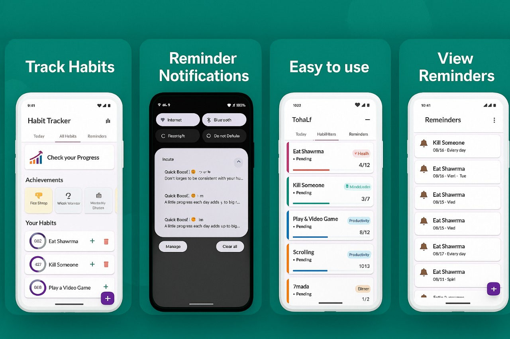

# Habit Tracking Flutter Application

A Flutter application designed to help users track and build positive habits. Features include habit creation, progress tracking, reminders, achievements, and data visualization through charts. The app utilizes Firebase for authentication and local notifications for reminders.



## Features

*   User Authentication (Login, Signup, Password Reset via Firebase)
*   Habit Creation and Management (Add, Increment Progress, Delete)
*   Categorization of Habits
*   Daily Habit Agenda
*   Progress Visualization with Charts (Active and Completed Habits)
*   Customizable Reminders with Local Notifications
*   Achievement System to Reward Progress
*   Engagement and Motivational Notifications

  
## Prerequisites

Before you begin, ensure you have met the following requirements:

*   **Flutter SDK:** Version 3.0.0 or higher. You can install it from the [Flutter official website](https://flutter.dev/docs/get-started/install).
*   **Dart SDK:** Comes bundled with Flutter.
*   **An IDE:** Such as Android Studio (with Flutter plugin) or Visual Studio Code (with Flutter extension).
*   **A Firebase Project:** This application requires a Firebase project for its backend services, particularly Authentication. Ensure you have one set up and properly configured for your Android/iOS app. You will need to place your `google-services.json` (for Android) and/or `GoogleService-Info.plist` (for iOS) in the respective platform folders.
*   **For Android:** Android Studio and Android SDK.
*   **For iOS:** Xcode (if you plan to build/run on iOS).

## Getting Started

1.  **Clone the App:**
    ```bash
    git clone https://github.com/RanaNader4/ITC_ONL2_SWD4_S4_Team1.git
    cd ITC_ONL2_SWD4_S4_Team1 
    ```

2.  **Get Packages:**
    ```bash
    flutter pub get
    ```

3.  **Run It!**
    Make sure you have an emulator running or a device connected.
    ```bash
    flutter run
    ```

    The app should now build and run!

## Android Setup Notes (If you encounter build issues)

The project is set up for Android, but here are quick checks if you see build errors:

*   **Core Library Desugaring:** `android/app/build.gradle.kts` needs:
    ```kotlin
    // In android { ... }
    compileOptions {
        // ...
        isCoreLibraryDesugaringEnabled = true 
    }
    // In dependencies { ... }
    coreLibraryDesugaring("com.android.tools:desugar_jdk_libs:2.1.4")
    ```
    *(This should already be configured correctly in the project.)*

*   **Permissions:** `android/app/src/main/AndroidManifest.xml` needs:
    ```xml
    <uses-permission android:name="android.permission.POST_NOTIFICATIONS"/>
    <uses-permission android:name="android.permission.SCHEDULE_EXACT_ALARM" />
    <uses-permission android:name="android.permission.USE_EXACT_ALARM" />
    ```
    *(This should also be configured correctly.)*

## Project Structure (lib/)

*   `main.dart`: Entry point of the application, Firebase initialization, theme setup, and root widget
*   `auth.dart`: Handles authentication state and navigates to login or home
*   `models/`: Contains data model classes (`Habit`, `Category`, `Achievement`, `Reminder`)
*   `screens/`: Contains UI screens for different parts of the app (login, signup, home page, settings, reminders)
*   `services/`: Contains service classes for notifications, achievements, and categories
*   `widgets/`: (If created) Would contain reusable custom widgets
*   `charts.dart`: Defines the page for displaying habit progress charts

## Additional Notes

*   **Firebase:** This application relies on Firebase for authentication. Ensure your Firebase project is set up and the necessary configuration files (`google-services.json` for Android, `GoogleService-Info.plist` for iOS) are correctly placed in your project. These files are typically added to `.gitignore` and should not be committed to the repository.
*   **Local Notifications:** The app uses `flutter_local_notifications` for reminders. Permissions for notifications and exact alarms are requested at runtime.
*   **Shared Preferences:** Used for storing habits, completed habits, achievements, categories, and theme preferences locally on the device.
*   **Fonts:** Uses `google_fonts` for the Lato font family and includes custom fonts ('DancingScript', 'Lora') as assets.
